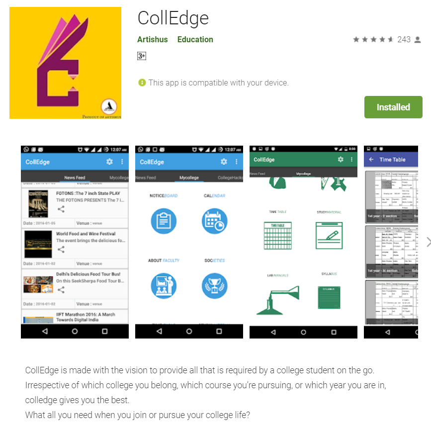

# CollEdge - University's ERP solution (Android application)

Below are the screenshots from Google Playstore,

# Introduction from Google PlayStore Description

CollEdge is made with the vision to provide all that is required by a college student on the go. Irrespective of which college you belong, which course you’re pursuing, or which year you are in, colledge gives you the best.

What all you need when you join or pursue your college life?

• Academic plan and relevant material
• All society information and updates
• Fest glimpse.
• Important notifications and college releases
• Placement talks
• Internship opportunities

CollEdge is capable of providing all that is happening around or in the campus at just a blink. Colledge gives you insights of all the events, academics, seminars and much more.

# Download colledge now and experience following features:

1. PUSH NOTIFICATION

Never miss any important information. Keep yourself updated what’s hot and happening in the campus via colledge app. Don’t worry about getting flooded with irrelevant and annoying notifications, since you will be provided with notification specific to the college you have registered for, on choosing the preference in the colledge app.

2. NEWS FEED

All that is happening in Delhi in various colleges, will be updated in news feed section of colledge app.

MyCollege

College and batch specific relevant details for all Delhi-NCR colleges
• Notice Board: Real time college announcements.
• Calendar: Academic calendar including academic schedule and list of holidays.
• Faculty: Department wise faculty list with their contact info.
• Societies: All cultural and non- cultural societies update just a click away.
• Time Table: Semester wise class schedule.
• Study Material: It includes Lab manuals, Syllabus, Notes, Previous year question papers.

Colleges under the hat of CollEdge App are:
- Maharaja Agrasen Insititute of technology (MAIT) , GGSIPU
- College of Vocation Studies (CVS) , Delhi University.
- Norther India Engineering College (NIEC) , GGSIPU
*Coming Soon
Placement details, internship opportunities, nearby PG’s option and alumni connect for GGSIPU.
Stop reading, just click and download colledge app.

# Personal Achievements/Features

- Developed from scratch and launched the application within a year reaching 4500+ downloads and 4.7/5 rating. 
- Lead a team of 3 developers for Windows / IOS application and back-end development.
- Worked on Google Analytics and increased the average active users by 200%.
- Launched the application in 2 colleges of Delhi University and 3 colleges of GGSIP University as their official application and managed 2500+ active users on the app.
- Co-founded official college society Edge-Squad in 5 colleges having 60+ students each.
- Increased Facebook reach by 2 folds, now over 2000 in one month.

